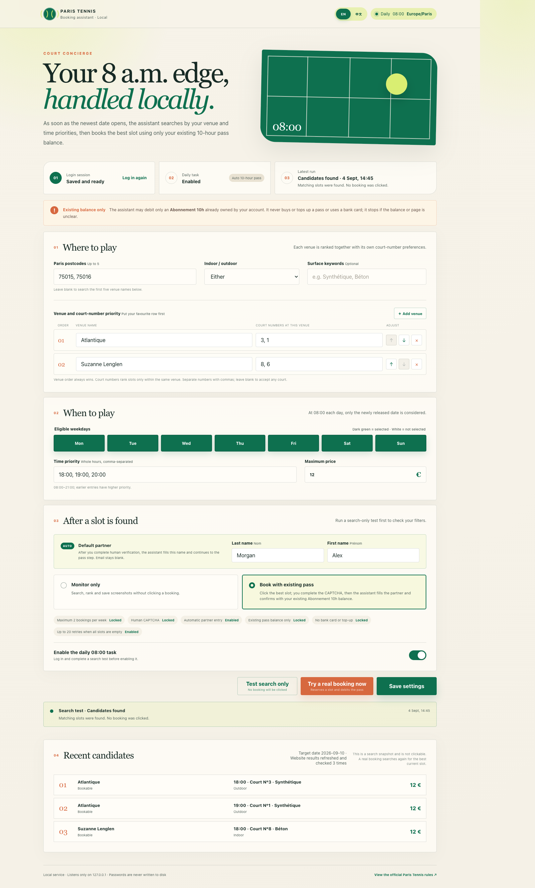

# 🎾 Paris Tennis Assistant

[中文说明](README_ZH.md) · English (default)

A privacy-conscious local assistant for searching and booking courts on [Paris Tennis](https://tennis.paris.fr/). It opens the newly released date at **08:00 Europe/Paris**, ranks slots by your venue, court-number and time preferences, and can continue a booking with an existing **Abonnement 10h** balance.

> [!IMPORTANT]
> This is an unofficial local tool. It does not bypass CAPTCHA, buy or top up a pass, or use a bank card. You remain responsible for your bookings and for complying with the official Paris Tennis rules.



## ✨ Highlights

- 🌍 English interface by default, with a persistent `EN / 中文` switch.
- 🏟️ Venue priority always wins; court numbers are ranked only within the same venue.
- 🕗 The scheduled and manual flows use the same newest-date search rules.
- 🔄 If the website incorrectly appears empty, the assistant can refresh and recheck up to 20 times.
- 🧑‍🤝‍🧑 After you complete CAPTCHA, it can fill your locally saved partner and continue automatically.
- 🎟️ It confirms only with an existing `Abonnement 10h` balance and stops on any ambiguous payment page.
- 🔒 The server listens only on `127.0.0.1`; login state and personal settings stay in the ignored `data/` directory.

## 🚀 Option 1 — Install automatically with Codex

**[⬇️ Download the latest release ZIP](https://github.com/bofenghuang/paris-tennis-assistant/releases/latest/download/paris-tennis-assistant.zip)**

For the easiest installation, copy the entire sentence below, paste it into Codex, and approve the displayed paths after checking them:

```text
Please download Paris Tennis Assistant from https://github.com/bofenghuang/paris-tennis-assistant/releases/latest/download/paris-tennis-assistant.zip and install it: extract the archive into ~/paris-tennis-assistant/, preserve any existing data/ directory, run npm install and npx playwright install chromium inside that directory, verify that package.json and public/index.html both exist, run npm test, then start the local app with npm start and tell me the result. Never upload or commit data/, .playwright-cli/, or unapproved local screenshots.
```

The copy button in the code block copies the complete instruction. Codex may request permission before downloading files or writing outside its current workspace.

## 🧰 Option 2 — Install manually

Requirements: Node.js 20 or newer, npm, and macOS/Linux/Windows with a Chromium-compatible desktop session.

```bash
git clone https://github.com/bofenghuang/paris-tennis-assistant.git
cd paris-tennis-assistant
npm install
npx playwright install chromium
npm test
npm start
```

Open [http://127.0.0.1:4173](http://127.0.0.1:4173).

## 🏁 First run

1. Add eligible weekdays, preferred times, and each venue together with its own court-number order. Venue order always has priority over court number.
2. Select **Log in** and complete the official Paris login in the browser that opens. The assistant stores the resulting session locally, never your password.
3. Select **Test search only** to verify filters and ranking. Candidate cards are a read-only snapshot.
4. Add the default partner. `Alex Morgan` is only a fictional example; enter the legal name of the person actually playing with you.
5. Select **Try a real booking now** only when you intend to reserve. Complete CAPTCHA yourself; the assistant then continues through partner, pass and final-confirmation steps.
6. Enable the daily task safety switch and save.

Command-line entry points:

```bash
npm run login
npm run dry-run
npm run run
```

## ⏰ Daily scheduling

The switch in the dashboard is a safety gate: scheduled live runs stop unless it is enabled. Configure a local scheduler separately—such as a Codex automation, `launchd`, or cron—to execute `npm run run` every day at **08:00 Europe/Paris**. The computer must be awake and able to open a visible browser for CAPTCHA.

## 🛡️ Privacy and safety model

- `data/auth.json` stores Playwright browser session state with owner-only file permissions. It may contain sensitive cookies and must never be shared.
- All of `data/`, Playwright CLI traces, dependencies, and local run screenshots are excluded from Git.
- CAPTCHA is always completed by the user. The browser stays open while the runner waits and then follows official page transitions.
- The assistant fills the configured partner, moves focus away so the official form can validate, and waits for **Etape suivante** to become enabled.
- It selects the full **J’utilise 1 heure de mon carnet en ligne** card, waits for the next step, and separately clicks the final **Confirmer la réservation** control on step 3/3.
- A booking is recorded as successful only after the website displays a confirmation result.
- Card fields, 3-D Secure, missing pass balance, unknown page structures, and incomplete venue results cause a safe stop.
- A hard limit prevents more than two locally recorded confirmed bookings per week.
- The search clears stale server-side venue filters and requests fresh pages without deleting login cookies.

## 🧪 Tests

```bash
npm test
```

The test suite covers configuration normalization, newest-date calculation, unreliable search results, authentication detection, partner entry, existing-pass selection and final confirmation.

## 🤝 Contributing

Issues and pull requests are welcome. Use fictional data in tests and documentation, keep all selectors defensive, and never attach authentication state or real booking screenshots. Public examples use the fictional name `Alex Morgan`; commit authorship belongs to the repository owner.

## ⚠️ Operational notes

- Paris Tennis can change its HTML and reservation flow without notice. Run a search-only test after website changes.
- A saved login session can expire; log in again from the dashboard when prompted.
- Cancellation and charging rules are controlled by Paris Tennis. Check the official site after every live attempt.
