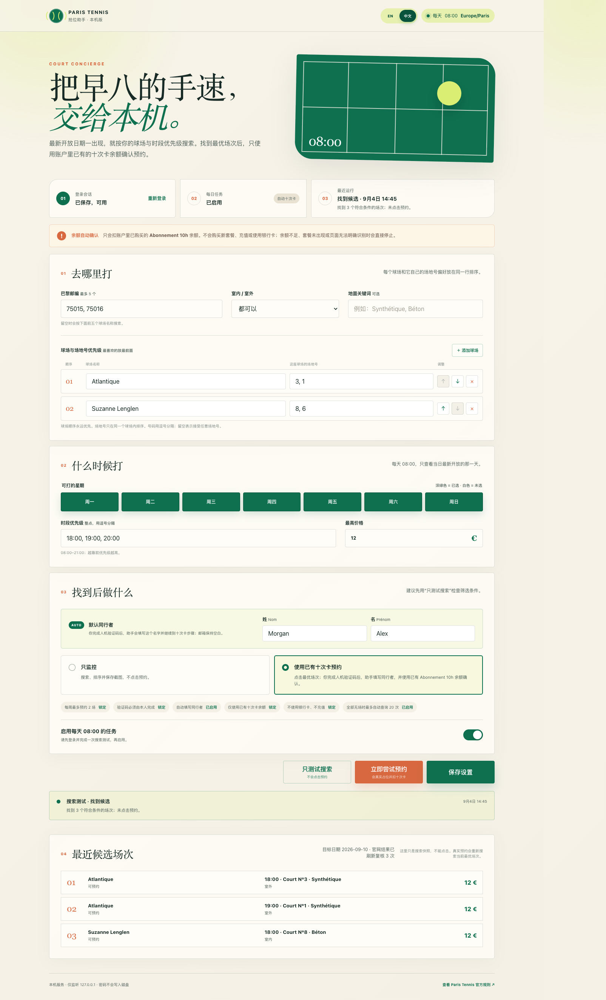

# 🎾 Paris Tennis 抢位助手

[English README](README.md) · 中文

这是一个注重隐私、只在本机运行的 [Paris Tennis](https://tennis.paris.fr/) 场地搜索与预约助手。它会在 **Europe/Paris 每天 08:00** 查看刚开放的最新日期，按照你的球场、场地号和时段偏好排序，并可使用账户里已有的 **Abonnement 10h** 余额继续预约。

> [!IMPORTANT]
> 这是非官方本机工具。它不会绕过验证码、购买或充值套餐，也不会使用银行卡。你仍需对自己的预约及遵守 Paris Tennis 官方规则负责。



## ✨ 主要功能

- 🌍 默认显示英文，可通过 `EN / 中文` 按钮切换，并记住上次选择。
- 🏟️ 球场优先级永远高于场地号；场地号只在同一球场内部排序。
- 🕗 每日任务和手动试运行共用同一套“只查最新开放日期”规则。
- 🔄 官网错误地显示全部无场时，可以自动刷新复核最多 20 次。
- 🧑‍🤝‍🧑 你亲自完成验证码后，助手可以填写保存在本机的同行者，并自动继续。
- 🎟️ 只会使用已有的 `Abonnement 10h` 余额；付款页含糊时立即安全停止。
- 🔒 服务只监听 `127.0.0.1`；登录状态与个人设置都留在被 Git 忽略的 `data/` 目录中。

## 🚀 方式一：交给 Codex 自动安装

**[⬇️ 下载最新 Release ZIP](https://github.com/bofenghuang/paris-tennis-assistant/releases/latest/download/paris-tennis-assistant.zip)**

最简单的安装方式：把下面整句话复制到 Codex，核对它显示的路径后同意所需权限：

```text
请从 https://github.com/bofenghuang/paris-tennis-assistant/releases/latest/download/paris-tennis-assistant.zip 下载并安装 Paris Tennis 抢位助手：解压到 ~/paris-tennis-assistant/，保留已有的 data/ 目录，在该目录运行 npm install 和 npx playwright install chromium，确认 package.json 与 public/index.html 均存在，运行 npm test，然后用 npm start 启动本机应用并告诉我结果。不要上传或提交 data/、.playwright-cli/ 或未经确认的本机截图。
```

代码块右上角的复制按钮会复制整条安装指令。Codex 下载文件或写入其当前工作区之外的位置时，可能会请求权限。

## 🧰 方式二：手动安装

环境要求：Node.js 20 或更高版本、npm，以及可以运行 Chromium 桌面窗口的 macOS、Linux 或 Windows。

```bash
git clone https://github.com/bofenghuang/paris-tennis-assistant.git
cd paris-tennis-assistant
npm install
npx playwright install chromium
npm test
npm start
```

然后打开 [http://127.0.0.1:4173](http://127.0.0.1:4173)。

## 🏁 首次使用

1. 选择可以打球的星期与时段，并把每座球场和它自己的场地号放在同一行排序。球场顺序永远优先于场地号。
2. 点击 **登录**，在弹出的官方 Paris 登录浏览器中完成登录。助手只把登录会话保存在本机，不会保存密码。
3. 点击 **只测试搜索**，检查筛选和排序是否符合预期。候选卡片只是只读快照。
4. 填写默认同行者。`Alex Morgan` 只是虚构示例，请填写实际与你打球者的法定姓名。
5. 只有在确实准备预约时才点击 **立即尝试预约**。验证码由你亲自完成；之后助手会继续同行者、十次卡和最终确认步骤。
6. 打开每日任务的安全开关并保存设置。

也可以使用命令行：

```bash
npm run login
npm run dry-run
npm run run
```

## ⏰ 每日定时运行

网页里的开关是安全闸门：没有启用时，定时的真实预约会直接停止。你需要另外配置本机调度器，例如 Codex automation、`launchd` 或 cron，让它在 **Europe/Paris 每天 08:00** 执行 `npm run run`。电脑必须处于开机状态，并能打开可见浏览器供你完成验证码。

## 🛡️ 隐私与安全设计

- `data/auth.json` 保存 Playwright 浏览器会话，文件权限仅限当前用户。它可能包含敏感 Cookie，绝不能分享。
- 整个 `data/`、Playwright CLI 记录、依赖包和本机运行截图都会被 Git 排除。
- 验证码始终由用户本人完成；执行器会保持浏览器打开，验证后跟随官网的正常跳转。
- 助手填写同行者后会主动让输入框失焦，等待官网把 **Etape suivante** 启用后再点击。
- 它会选择整张 **J’utilise 1 heure de mon carnet en ligne** 卡片，等待进入下一步，并在 3/3 页面单独点击最终的 **Confirmer la réservation**。
- 只有官网显示确认结果时，才会记录为预约成功。
- 出现银行卡字段、3-D Secure、十次卡余额不明、未知页面结构或球场结果不完整时都会安全停止。
- 本机硬限制不允许每周记录超过两场已确认预约。
- 搜索前会清除官网服务器会话里遗留的地点筛选并请求新页面，但不会删除登录 Cookie。

## 🧪 测试

```bash
npm test
```

测试覆盖配置清洗、最新日期计算、异常搜索结果、登录检测、同行者填写、已有十次卡选择以及最终确认。

## 🤝 参与贡献

欢迎提交 issue 和 pull request。测试与文档只能使用虚构资料，网页选择器要保持防御性设计，绝不能附带登录会话或真实预约截图。公开示例使用虚构姓名 `Alex Morgan`；提交作者使用仓库所有者本人的 GitHub 身份。

## ⚠️ 运行提醒

- Paris Tennis 随时可能修改 HTML 和预约流程；官网变化后请先运行一次搜索测试。
- 保存的登录会话可能过期；网页提示时重新登录即可。
- 取消和收费规则由 Paris Tennis 决定；每次真实尝试后都应去官网账户核对。
